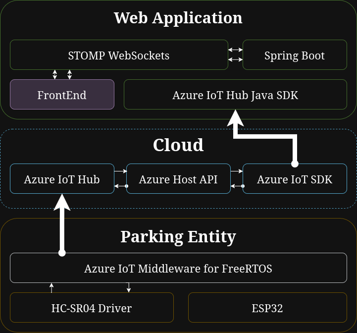

# IoT-Based Smart Parking Monitoring System

Prototype example of a smart parking monitoring system built using IoT technologies and cloud services provided by Microsoft Azure Cloud. It enables real-time detection and visualization of parking space occupancy using embedded devices, a cloud backend, and a web-based frontend.

---

## System Architecture

The system is composed of three main components, each developed independently and connected through Azure:

1. **Embedded Device (ESP32)**  
   - Detects whether a parking space is occupied by measuring the distance to the floor or a vehicle.
   - Written in **C** using **Azure Middleware for FreeRTOS**.
   - Mounted with an ultrasonic distance sensor (HC-SR04).
   - Sends data in real time to Azure IoT Hub over MQTT.

2. **Cloud Backend (Java)**  
   - Processes the received data and forwards it to the frontend using **WebSockets** for real-time updates.
   - Connects to **Azure IoT Hub** and polls messages from connected devices.
   - Written in **Java** using **Spring Framework** libraries.
   - Hosted as an **Azure Web App Service**.

3. **Frontend (Web Application)**  
   - Receives live data from the backend via WebSockets.
   - Displays the current status of monitored parking spaces.
   - **JS** script performs real-time data visualization.

---

## ☁️ Azure Resources Used

The project utilizes three Azure services:

- **Azure IoT Hub**  
  Used to securely connect ESP32 devices and receive telemetry data in real time over MQTT. Supports device authentication via symmetric keys.

- **Azure Web App Service**  
  Hosts the web-based backend + frontend logic for handling and visualizing parking occupancy. Publicly accessible and scalable.

- **Resource Group**  
  Groups and manages all related Azure resources under a single logical unit for cost and access control.

---

## 🔧 Embedded IoT Parking Entity (ESP32)

- Uses **Azure Middleware for FreeRTOS** for MQTT and TLS connectivity.
- Connects to Wi-Fi and authenticates with Azure IoT Hub using symmetric keys.
- Measures distance using the **HC-SR04 ultrasonic sensor**.
- During startup, performs **calibration measurements** to establish a reference distance.
- Sends a JSON payload every 10 seconds containing:
  - Occupancy status (`occupied`)
  - Timestamp of measurement
  - Whether the occupancy state has changed (`stateChanged`)

---

## 🔗 Communication Flow

1. **ESP32 → Azure IoT Hub (MQTT + TLS)**  
   Sends JSON messages every 10 seconds.

2. **Azure IoT Hub → Java Backend**  
   Backend pulls messages via Azure APIs, processes and prepares them for frontend delivery.

3. **Java Backend → Web Frontend (WebSockets)**  
   Sends real-time updates to the browser-based dashboard.

---

## 📦 Technologies Used

| Component     | Language    | Tools & Libraries                                   |
|---------------|-------------|-----------------------------------------------------|
| Embedded      | C           | ESP32, FreeRTOS, Azure Middleware                   |
| Backend       | Java        | Java 21, Azure SDK, Spring Boot, STOMP WebSockets   |
| Frontend      | JavaScript  | HTML, CSS, JavaScript, STOMP WebSockets             |

---
